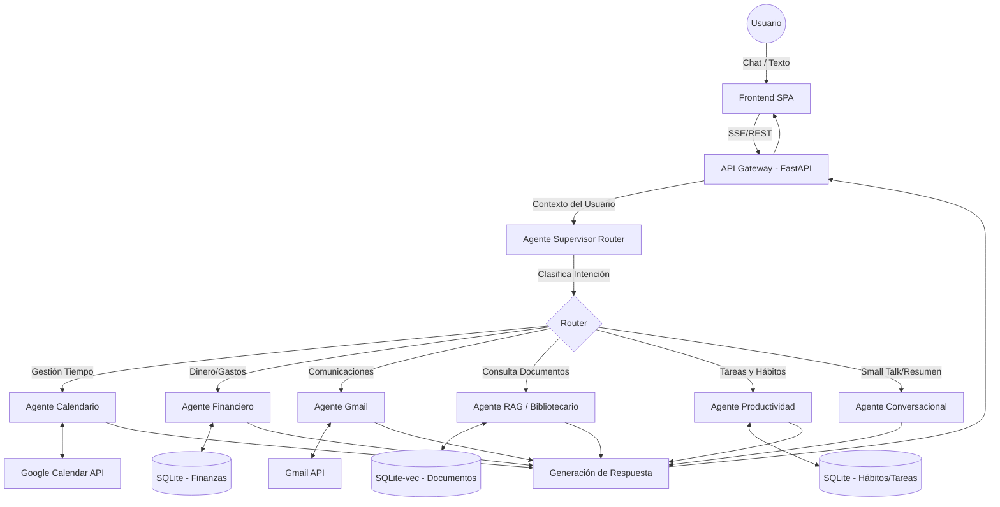

# Propuesta de Arquitectura de Sistemas: MarcoAI

## 1. Visión General de la Arquitectura

MarcoAI se diseña bajo un modelo **Híbrido y Modular**, priorizando la extrema eficiencia de recursos (debido a la limitación de 1GB de RAM de la Raspberry Pi 3) y la protección del hardware (desgaste de la SD).

El sistema se divide en un **Frontend Ligero** (SPA) y un **Backend Unificado (Core + IA)** escrito en Python altamente optimizado. Esta unificación en un solo servicio (monolito modular) permite contenerizar la aplicación de forma eficiente, evitando el consumo de memoria base duplicado que implicaría tener múltiples microservicios en Docker, y gestionando tanto la lógica tradicional como la orquestación de agentes bajo el mismo proceso.

## 2. Stack Tecnológico Seleccionado

### 2.1. Frontend (Interfaz de Usuario)

- **Framework:** **React + Vite** (o **SvelteKit** para minimizar aún más la carga en el cliente). Vite asegura un build rápido y un bundle ligero pero con alta calidad en la interfaz de usuario, siendo esta moderna y atractiva, incluyendo animaciones y transiciones suaves.
- **UI/Estilos:** **Tailwind CSS** + Componentes accesibles (ej. Radix UI o shadcn/ui).
- **Gestión del Estado:** **Zustand** (ligero, ideal para sincronizar el estado del Chat y los Dashboards sin el boilerplate de Redux).
- **Gráficos (Dashboards):** **Recharts** o **Chart.js** (ligeras y modulares para los módulos de Finanzas y Hábitos).
- **Comunicación:** **Server-Sent Events (SSE)** o **WebSockets** para el chat en tiempo real y _streaming_ de las respuestas de los agentes.

### 2.2. Backend (API, Auth, Lógica de Negocio y Orquestación)

- **Lenguaje y Framework:** **Python 3.11+** con **FastAPI**.
  - _Justificación:_ Es el estándar de la industria para IA. FastAPI es asíncrono, rápido y permite un consumo de memoria contenido si se unifican las rutas tradicionales y la IA en la misma aplicación.
- **Base de Datos Relacional:** **SQLite** (Modo WAL activado).
  - _Justificación:_ Sin servidor, consumo de memoria casi nulo. Al activar el modo Write-Ahead Logging (WAL), se permiten lecturas concurrentes y se reducen los bloqueos.
- **Autenticación:** **Google OAuth 2.0** integrado nativamente en Python (JWT para sesiones stateless, evitando almacenar sesiones en BD).

### 2.3. Herramientas de IA (Agentes y RAG)

- **Framework Multi-Agente:** **LangGraph** (por encima de LangChain estándar o CrewAI).
  - _Justificación:_ Permite definir flujos de estado (StateGraphs) deterministas. Es ideal para el patrón "Supervisor/Router" y permite ciclos y memoria a corto plazo eficientes.
- **Base de Datos Vectorial:** **SQLite-vec** (extensión de SQLite para vectores).
  - _Justificación:_ Al tener todo en Python, usar la extensión vectorial de SQLite es la opción más ligera para la Raspberry Pi 3, evitando tener que levantar un contenedor o base de datos adicional.
- **Embeddings:** Generados vía API externa (ej. OpenAI `text-embedding-3-small` o Cohere) para ahorrar RAM, y almacenados localmente.

---

## 3. Arquitectura del Sistema Multi-Agente (Orquestación)

El sistema utiliza un patrón de **Enrutamiento Semántico (Semantic Routing)** y **Arquitectura de Supervisor**.

### 3.1. Flujo de Interacción

1.  **Entrada:** El usuario escribe _"Mueve la reunión de mañana y apunta 45€ de gasolina"_.
2.  **Supervisor (Router):** Un LLM rápido y barato (ej. Haiku o Gemini Flash) analiza la entrada. Detecta **dos intenciones**.
3.  **Delegación Paralela (Sub-grafos):** - Envía la intención 1 al _Agente Calendario_ (accede a GCal).
    - Envía la intención 2 al _Agente Financiero_ (escribe en SQLite).
4.  **Síntesis:** El Supervisor recoge ambos resultados ("Reunión movida" y "Gasto registrado") y genera la respuesta final unificada con confirmación (HU08).

### 3.2. RAG con Citas (HU33, HU34)

Para evitar alucinaciones, el Agente RAG utiliza el patrón **Self-Querying Retriever**:

- El usuario sube un PDF. FastAPI lo procesa, guarda el archivo físico en un volumen de Docker montado en la SD y extrae el texto.
- El texto se divide en fragmentos (chunking), se obtienen los embeddings vía API y se guardan en SQLite-vec vinculados al ID del usuario y nombre del archivo.
- Al preguntar, se recuperan los chunks relevantes. El prompt del LLM fuerza el formato: _"Responde solo con este contexto. Cita la fuente usando [Nombre del Archivo]."_.

---

## 4. Estrategias de Mitigación de Riesgos (Risk Management)

Para cumplir con las severas limitaciones de la Raspberry Pi 3 (1GB RAM) y la Tarjeta SD utilizando Docker:

### 4.1. Protección de la Tarjeta SD (HU05)

- **Desactivación de Swap:** Evitar que el sistema operativo pagine memoria en la SD, lo que la destruiría rápidamente. Si Docker se queda sin memoria, es mejor que el OOM Killer reinicie el contenedor.
- **Control de Logs de Docker:** Se configurará estrictamente el _logging driver_ en el `docker-compose.yml` (`max-size: "10m"`, `max-file: "3"`) para evitar que los logs de los contenedores crezcan infinitamente y corrompan la tarjeta SD.
- **Escritura Diferida (Batching):** El backend en Python acumulará telemetría o pequeños cambios de estado no críticos en memoria y hará _commits_ masivos a la base de datos SQLite (montada como volumen) cada X minutos.

### 4.2. Minimización de Memoria con Docker (1GB RAM constraint)

- **Imágenes Ligeras (Alpine/Slim):** Se utilizarán imágenes base ultraligeras de Docker (como `python:3.11-slim` o `alpine`) para minimizar el peso (footprint) del sistema operativo virtualizado.
- **Límites de Recursos en Docker Compose:** Se establecerán hard limits de memoria para el contenedor (`deploy.resources.limits.memory: 400M`). Al tener todo unificado en un solo contenedor FastAPI, este límite asegura que queden ~600MB de RAM libres para el sistema operativo host de la Raspberry.
- **Servir Frontend Estáticamente:** En producción, el build de React/Vite no correrá en un contenedor de Node.js (que consume mucha RAM), sino que los archivos estáticos serán servidos directamente por FastAPI o por un contenedor de Nginx extremadamente ligero (~5MB RAM).

### 4.3. Rotación de APIs y Control de Costes (HU49)

Se implementará un **Gestor de LLMs (LLM Gateway)** nativo en el código:

- El sistema tendrá configuradas 3 claves API (ej. OpenAI, Anthropic, Google Gemini) inyectadas mediante un archivo `.env` en Docker.
- **Enrutamiento Inteligente:** Tareas simples (Clasificación del Supervisor, Extracción de metadatos) se enviarán al modelo más barato (ej. Gemini 1.5 Flash). Tareas complejas (RAG o Redacción de correos formales) se enviarán a un modelo de mayor razonamiento.
- **Fallback Automático:** Si la API principal da un error `429 Too Many Requests` o el token del usuario supera un límite diario, el sistema cambia automáticamente al proveedor secundario.

### 4.4. Aislamiento Multi-Tenant (HU04)

Aunque sea un entorno self-hosted, si hay varios miembros de la familia:

- **Row-Level Security (lógica):** Cada tabla en SQLite (eventos, hábitos, gastos, chunks de RAG) tendrá una columna `user_id`. FastAPI inyectará automáticamente este ID (extraído del token JWT validado en cada request) en cada consulta. El Agente de IA nunca recibirá datos sin que previamente hayan sido filtrados por este ID.
