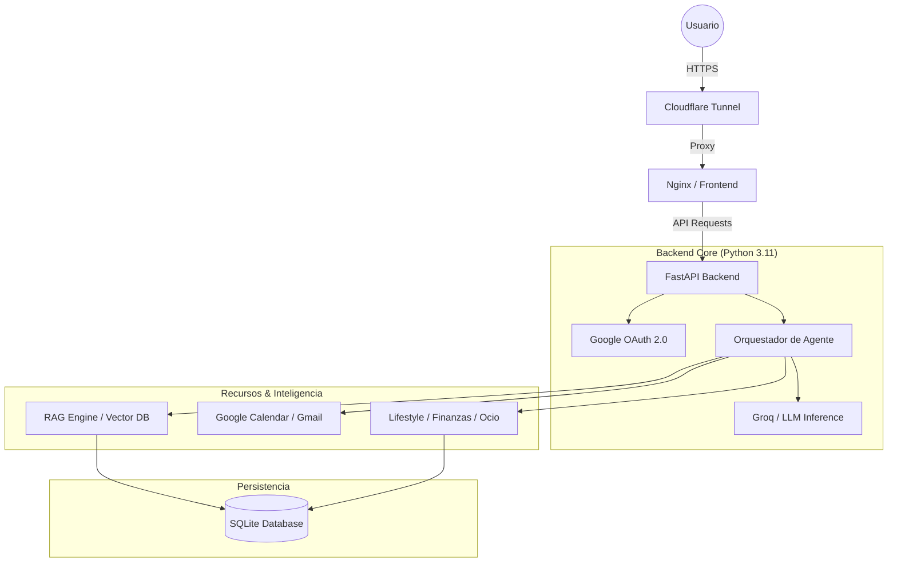

# 🤖 Marco AI - Tu Agente Personal Inteligente

**Marco AI** es un asistente virtual de vanguardia diseñado para centralizar y simplificar tu vida digital. Optimizado para ejecutarse en hardware eficiente como una **Raspberry Pi 3**, Marco combina la potencia de los modelos de lenguaje más avanzados (Llama 3.3, Gemini 2.0) con herramientas locales para gestionar tu tiempo, finanzas y hábitos.


## 🌌 Visión General
Marco no es solo un chatbot; es un **agente de acción**. Gracias a su orquestador inteligente, puede razonar sobre tus peticiones, consultar tu historial (RAG), interactuar con APIs externas y ejecutar comandos asíncronos para mantener tu mundo en orden, todo a través de una interfaz elegante y minimalista.

## 🏗️ Arquitectura Técnica
El sistema está construido bajo una arquitectura de microservicios ligera y robusta:



- **Inferencia Ultra-Rápida:** Delegada a Groq para respuestas en milisegundos.
- **Memoria de Largo Plazo (RAG):** Implementada en SQLite con búsqueda vectorial (VSS) y aislamiento total por usuario.
- **Frontend SPA:** Sistema Glassmorphism ultra-ligero (<5MB RAM) en Vanilla JS.

## 🛠️ Capacidades del Agente (Lista Técnica)

Marco AI puede realizar las siguientes acciones de forma autónoma mediante lenguaje natural:

### 📅 Gestión de Tiempo (Google Calendar)
- **Consultar Agenda:** Listar tus próximos eventos y compromisos.
- **Crear Eventos:** Añadir citas especificando nombre, fecha y hora de inicio/fin.
- **Modificar Eventos:** Cambiar el nombre, la fecha o la hora (inicio/fin) de eventos existentes.
- **Eliminar Eventos:** Borrar eventos del calendario por completo.

### 📧 Comunicación (Gmail)
- **Leer Correos:** Buscar y resumir mensajes recibidos o filtrar por criterios.
- **Enviar Emails:** Redactar y enviar correos electrónicos completos.
- **Organización:** Crear etiquetas, listar carpetas y modificar etiquetas de mensajes existentes.

### 💰 Finanzas Personales
- **Registro de Gastos:** Anotar gastos mensuales recurrentes y gastos puntuales.
- **Gestión de Ingresos:** Registrar entradas de dinero para llevar el balance.
- **Control de Suscripciones:** Guardar y monitorizar servicios (Netflix, Spotify, etc.).
- **Balance General:** Calcular automáticamente tu presupuesto mensual restante (Ingresos - Gastos).

### 🧘 Lifestyle y Hábitos
- **Gestión de Hábitos:** Añadir nuevos hábitos que desees seguir.
- **Seguimiento Diario:** Marcar hábitos como realizados o pendientes. 
  *(Nota: Los hábitos se reinician visualmente cada día para fomentar la constancia).*
- **Eliminación:** Borrar hábitos que ya no desees seguir.

### 🍱 Alimentación y Compras
- **Planificación de Comidas:** Añadir platos a tu plan de dieta semanal.
- **Lista de Compra:** Añadir ítems dinámicamente según los necesites.

### 🎮 Ocio y Entretenimiento
- **Radar de Ocio:** Guardar planes futuros, conciertos o eventos con categoría y fecha.
- **Monitor de Ofertas:** Registrar ofertas de videojuegos (título, tienda, precio y descuento).

### 🧠 Memoria y Conocimiento (RAG)
- **Búsqueda Inteligente:** Localizar cualquier dato guardado anteriormente mediante búsqueda semántica.
- **Notas Rápidas:** Guardar fragmentos de información general en tu memoria persistente.
- **Limpieza de Memoria:** Borrar registros específicos o tipos de datos de forma selectiva.

---

## 🚀 Instalación Rápida (Docker)

1. **Clonar e instalar:**
   ```bash
   git clone https://github.com/marquito3012/marcoai.git && cd marcoai
   cp .env.example .env
   ```
2. **Configurar `.env`** con tus API Keys (Groq, Google OAuth).
3. **Levantar:**
   ```bash
   docker compose up -d --build
   ```

---
*Desarrollado con ❤️ para la comunidad de código abierto.*
