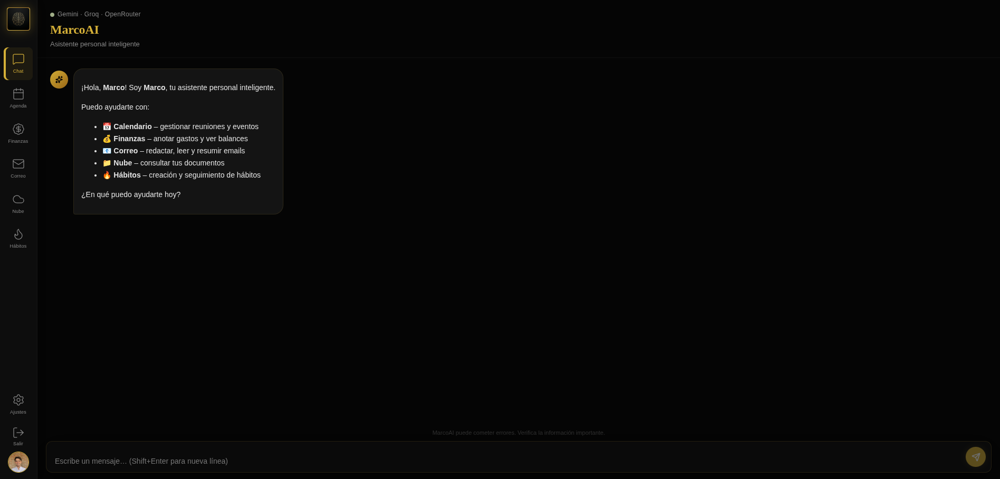
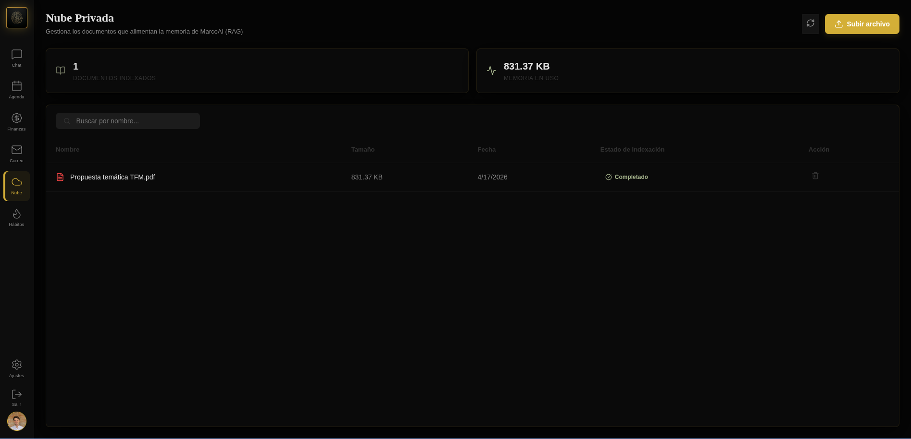
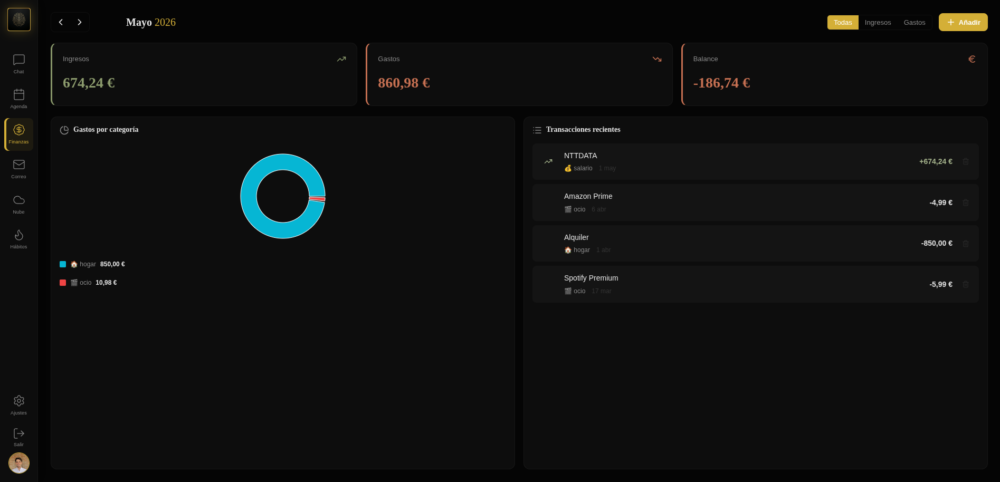
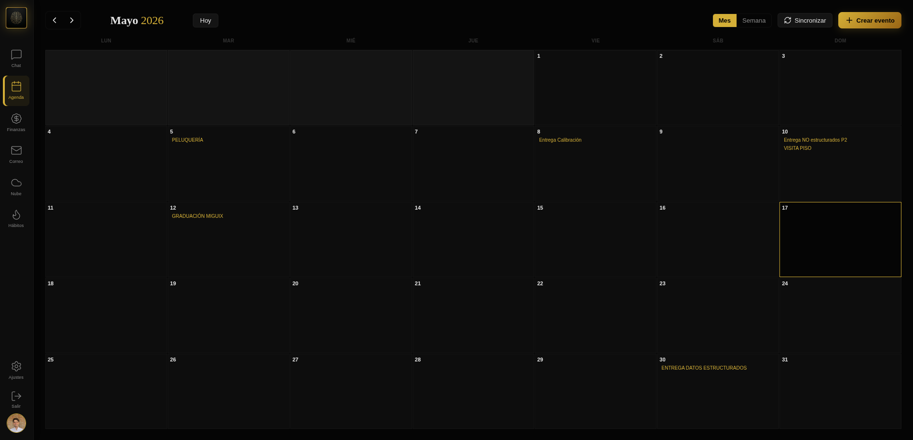
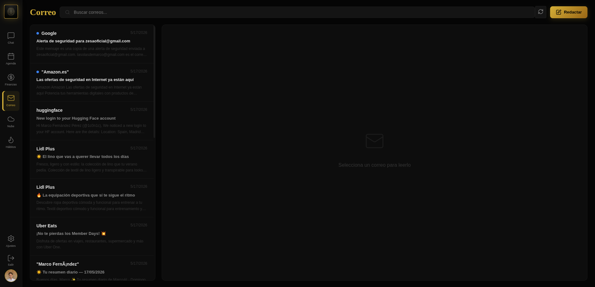
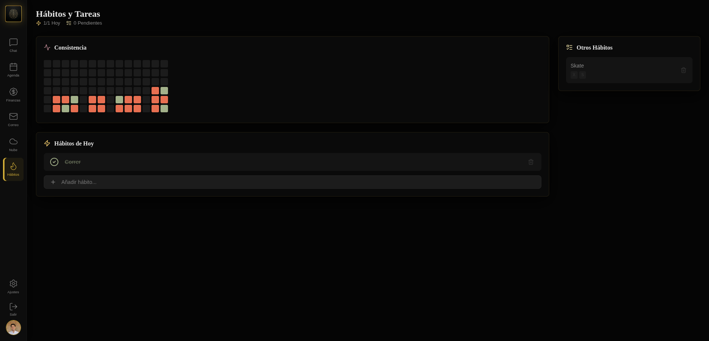
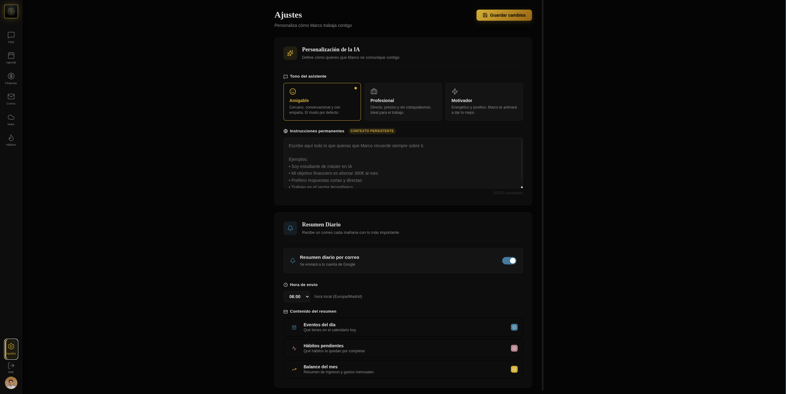

# 🤖 MarcoAI – Personal Intelligence Assistant

**MarcoAI** es un asistente personal inteligente de última generación diseñado para centralizar tu productividad, finanzas y conocimientos en un solo lugar. Construido con una arquitectura de **agentes supervisores (LangGraph)** y capacidades de **RAG (Retrieval-Augmented Generation)**, Marco no solo responde preguntas, sino que gestiona tu vida digital de forma proactiva.

Diseñado para funcionar en hardware limitado como una **Raspberry Pi 3** (1 GB RAM), con una arquitectura **Local-First** que prioriza la privacidad y el rendimiento.


---

## ✨ Características Principales

### 🧠 Arquitectura Multi-Agente Supervisada

Marco implementa un sistema jerárquico con un **Supervisor** que clasifica las intenciones del usuario y enruta las tareas a nodos especializados:

```
User Message → Supervisor Node (clasificación de intención)
                  ↓
    Routes to: General Chat / Calendar / Finance / Mail / Files / Habits
                  ↓
    Cada agente ejecuta herramientas específicas del dominio
                  ↓
    Respuesta generada con streaming SSE al frontend
```

**Capacidades de los Agentes:**

- **🗨️ General Chat:** Conversación contextual con memoria de sesión y tono personalizado del usuario (amigable, profesional, motivacional).
- **📁 Files (RAG):** Búsqueda semántica sobre documentos PDF y texto usando **SQLite-vec** con embeddings de Gemini. Tu "nube privada" de conocimiento.
- **💰 Finance:** Seguimiento de ingresos y gastos, balances mensuales, análisis por categoría con detección automática y visualizaciones con Recharts.
- **📅 Calendar:** CRUD completo con Google Calendar — crear, listar, actualizar y eliminar eventos.
- **📬 Mail:** Lectura de la bandeja de entrada y redacción de mensajes a través de Gmail.
- **✅ Habits:** Creación, gestión y seguimiento de hábitos con horarios configurables y logs diarios.

### 🔒 Privacidad y Rendimiento (Edge-Ready)

- **Local First:** Base de datos SQLite ligera con extensiones vectoriales nativas (`sqlite-vec`). Todo el procesamiento se ejecuta localmente.
- **Optimizado para RPi:** Diseñado para funcionar en hardware limitado como una **Raspberry Pi 3** (1 GB RAM).
- **Cloudflare Tunnels:** Acceso seguro desde cualquier lugar sin abrir puertos ni configurar DNS.
- **JWT Authentication:** Autenticación segura con tokens JWT y refresh tokens.

### 💡 Gateway de LLM con Failover

- **Multi-Provider:** Soporte para **Google Gemini**, **Groq** y **OpenRouter** con fallback automático.
- **Cost-Aware Routing:** Enrutamiento inteligente basado en costo (FAST / STANDARD / INTELLIGENT).
- **Resiliencia:** Si un proveedor falla, el sistema pasa automáticamente al siguiente disponible.

### 💎 Interfaz de Usuario Moderna

Frontend construido con **React 18 + Vite**, **Tailwind CSS**, **Zustand** para estado y **React Router** para navegación. Incluye:

- Modo oscuro con diseño responsivo.
- Streaming de respuestas en tiempo real con SSE.
- Visualizaciones de datos con **Recharts**.
- Iconos con **lucide-react**.
- Renderizado de markdown con **react-markdown**.

---

## 📸 Capturas de Pantalla

### 💬 Chat Principal

Interfaz de conversación con streaming de respuestas en tiempo real, historial de mensajes y badge de routing que muestra el agente asignado.



### 📁 Documentos (RAG)

Panel de carga de archivos PDF y texto con búsqueda semántica y resultados destacados.



### 💰 Finanzas

Dashboard financiero con balances mensuales, gráfico de ingresos vs gastos, y listado de transacciones categorizadas.



### 📅 Calendario

Vista de Google Calendar integrada con los eventos sincronizados y opción de crear nuevos eventos directamente desde el chat.



### 📬 Gmail

Bandeja de entrada de Gmail integrada con los correos organizados y opción de redactar mensajes nuevos.



### ✅ Hábitos

Dashboard de seguimiento de hábitos con visualización de racha diaria, % de consistencia y logs de actividad.



### ⚙️ Configuración

Panel de preferencias del usuario para personalizar el tono de la IA, gestionar su perfil y ajustar las opciones del sistema.



---

## 🛠️ Stack Tecnológico

### Backend

| Tecnología               | Propósito                                                                    |
| ------------------------ | ---------------------------------------------------------------------------- |
| **Python 3.11**          | Lenguaje principal                                                           |
| **FastAPI**              | Framework API REST de alto rendimiento                                       |
| **Uvicorn** (con uvloop) | Servidor ASGI                                                                |
| **LangGraph**            | Orquestación de agentes con grafos de estado                                 |
| **LangChain**            | Capa de abstracción para LLM                                                 |
| **Google Gemini**        | LLM principal + embeddings (`gemini-3.1-flash-lite`, `gemini-embedding-001`) |
| **Groq**                 | LLM de respaldo (`llama-3.3-70b`)                                            |
| **OpenRouter**           | LLM de respaldo (`gemma-4`, `qwen-3-coder`, `qwen-3-next`)                   |
| **SQLAlchemy**           | ORM para SQLite asíncrono                                                    |
| **aiosqlite**            | Driver SQLite asíncrono                                                      |
| **sqlite-vec**           | Búsqueda de similitud vectorial                                              |
| **PyMuPDF**              | Extracción de texto de PDF para RAG                                          |
| **PyJWT (python-jose)**  | Autenticación con tokens JWT                                                 |
| **passlib + bcrypt**     | Hash de contraseñas                                                          |
| **pydantic**             | Validación de datos y configuración                                          |
| **tenacity**             | Lógica de retry y fallback                                                   |
| **APScheduler**          | Programador para notificaciones diarias                                      |
| **Google API Client**    | Integración con Gmail y Calendar                                             |
| **httpx**                | Cliente HTTP para OpenRouter                                                 |

### Frontend

| Tecnología                      | Propósito                               |
| ------------------------------- | --------------------------------------- |
| **JavaScript (React 18)**       | Framework UI                            |
| **Vite**                        | Herramienta de build ultra-rápida       |
| **React Router v7**             | Ruteo client-side                       |
| **Tailwind CSS (v4)**           | Estilos utility-first                   |
| **Zustand**                     | Gestión de estado                       |
| **Recharts**                    | Visualización de datos (gráficos)       |
| **lucide-react**                | Librería de iconos                      |
| **react-markdown + remark-gfm** | Renderizado de markdown para respuestas |
| **ESLint**                      | Linting                                 |

### Infraestructura

| Tecnología                  | Propósito                                     |
| --------------------------- | --------------------------------------------- |
| **Docker + Docker Compose** | Orquestación de contenedores                  |
| **Nginx**                   | Proxy inverso y serving de archivos estáticos |
| **Cloudflared**             | Túneles seguros para exposición a internet    |

---

## 🚀 Instalación Rápida

### Requisitos Previos

- Docker y Docker Compose instalados.
- Una API Key de Google Gemini (obtenida en [Google AI Studio](https://aistudio.google.com/)).
- API Keys opcionales para providers de respaldo (Groq, OpenRouter).

### Pasos

1. **Clonar el repositorio:**

   ```bash
   git clone https://github.com/tu-usuario/marcoai.git
   cd marcoai
   ```

2. **Configurar variables de entorno:**
   Copia el archivo de ejemplo y ajusta los valores según tus credenciales:

   ```bash
   cp .env.example .env
   ```

   Luego edita `.env` con tu configuración. El archivo incluye todas las variables necesarias:

   **Variables mínimas (obligatorias):**

   ```bash
   GOOGLE_API_KEY=tu_api_key_aqui
   GOOGLE_CLIENT_ID=tu_client_id
   GOOGLE_CLIENT_SECRET=tu_client_secret
   SECRET_KEY=una_clave_segura_para_jwt
   DATABASE_URL=sqlite+aiosqlite:///./marcoai.db
   ```

   **Variables opcionales:**

   ```bash
   # LLM de respaldo con fallback
   GROQ_API_KEY=tu_groq_api_key
   OPENROUTER_API_KEY=tu_openrouter_api_key

   # Túnel seguro (sin necesidad de abrir puertos)
   CLOUDFLARE_TUNNEL_TOKEN=tu_token_opcional
   ```

3. **Desplegar con Docker Compose:**

   ```bash
   docker compose up -d --build
   ```

4. **Acceder:**
   Abre tu navegador en `http://localhost` (o en tu dominio configurado con Cloudflare).

### Desarrollo Local (Backend)

```bash
cd backend
uvicorn app.main:app --host 0.0.0.0 --port 8000
```

### Desarrollo Local (Frontend)

```bash
cd frontend
npm run dev
```

---

## 📡 API Endpoints

La API está disponible en `/api/v1/` con documentación automática en `/docs` (Swagger/OpenAPI).

| Método     | Endpoint                | Descripción                         |
| ---------- | ----------------------- | ----------------------------------- |
| `GET`      | `/health`               | Health check                        |
| `GET`      | `/docs`                 | Documentación Swagger/OpenAPI       |
| `POST`     | `/api/v1/login`         | Login con Google OAuth              |
| `POST`     | `/api/v1/login/refresh` | Refresh del token auth              |
| `POST`     | `/api/v1/logout`        | Cerrar sesión                       |
| `POST`     | `/api/v1/chat`          | Chat single-turn (JSON)             |
| `POST`     | `/api/v1/chat/stream`   | Chat streaming con SSE              |
| `POST/GET` | `/api/v1/calendar/*`    | CRUD de Google Calendar             |
| `POST/GET` | `/api/v1/finance/*`     | Operaciones financieras             |
| `POST/GET` | `/api/v1/gmail/*`       | Operaciones de Gmail                |
| `POST/GET` | `/api/v1/documents/*`   | Upload de documentos + búsqueda RAG |
| `POST/GET` | `/api/v1/habits/*`      | Gestión de hábitos                  |
| `POST/GET` | `/api/v1/settings/*`    | Preferencias de usuario             |

---

## 📂 Estructura del Proyecto

```text
├── README.md                       # Documentación principal
├── docker-compose.yml              # Orquestación de servicios (backend, nginx, cloudflared)
├── .gitignore                      # Archivos y secretos excluidos del versionado
├── backend/                        # Aplicación Python FastAPI
│   ├── Dockerfile                  # Imagen Python 3.11-slim con uvicorn
│   ├── requirements.txt            # Dependencias Python
│   ├── scripts/
│   │   └── test_gateway.py         # Script para probar el LLM gateway
│   └── app/
│       ├── main.py                 # Entry point FastAPI, lifespan, CORS, routers
│       ├── agents/                 # Arquitectura multi-agente
│       │   ├── supervisor.py       # Grafo LangGraph del supervisor + API streaming
│       │   ├── nodes.py            # Nodos de agentes especializados (702 líneas)
│       │   ├── states.py           # Definición de AgentState (TypedDict)
│       │   ├── prompts.py          # Prompts del sistema, clasificación de intención
│       │   └── tools/
│       │       ├── calendar_tools.py       # Herramientas de Google Calendar
│       │       ├── finance_tools.py        # Herramientas financieras
│       │       ├── gmail_tools.py          # Herramientas de Gmail
│       │       └── doc_tools.py            # Herramientas de documentos/RAG
│       ├── api/
│       │   ├── routes/
│       │   │   ├── auth.py            # OAuth Google: login, refresh
│       │   │   ├── chat.py            # Chat (JSON + SSE streaming)
│       │   │   ├── calendar.py        # Endpoints de Calendar
│       │   │   ├── documents.py       # Upload y búsqueda RAG
│       │   │   ├── finance.py         # Operaciones financieras
│       │   │   ├── gmail.py           # Operaciones de Gmail
│       │   │   ├── habits.py          # Gestión de hábitos
│       │   │   ├── llm.py             # Endpoints de prueba del gateway LLM
│       │   │   └── settings.py        # Preferencias de usuario
│       │   ├── schemas.py             # Modelos Pydantic
│       │   └── deps.py                # Inyección de dependencias auth
│       ├── core/
│       │   ├── config.py              # Configuración pydantic-settings (.env)
│       │   ├── security.py            # Utilidades JWT y password hashing
│       │   └── scheduler.py           # APScheduler para notificaciones diarias
│       ├── db/
│       │   ├── base.py                # Engine y session de SQLAlchemy
│       │   └── models.py              # Modelos ORM (User, ChatMessage, Transaction,
│       │                                  Document, Habit, HabitLog, UserSettings)
│       └── services/
│           ├── llm_gateway.py         # Gateway multi-provider con fallback
│           ├── calendar_service.py    # Servicio de Google Calendar
│           ├── finance_service.py     # Servicio financiero
│           ├── gmail_service.py       # Servicio de Gmail API
│           ├── document_service.py    # Procesamiento de documentos y RAG
│           ├── habits_service.py      # Seguimiento de hábitos
│           └── notification_service.py # Notificación de resumen diario
├── frontend/                         # Frontend React + Vite SPA
│   ├── package.json                  # Dependencias y scripts npm
│   ├── vite.config.js                # Vite + Tailwind + React config
│   ├── public/                       # Assets estáticos (favicon, logo)
│   └── src/
│       ├── main.jsx                  # Entry point React
│       ├── App.jsx                   # React Router (login + routes protegidas)
│       ├── App.css                   # Estilos globales
│       ├── index.css                 # Estilos base
│       ├── components/
│       │   ├── chat/
│       │   │   ├── MessageBubble.jsx     # Burbuja de mensajes de chat
│       │   │   └── RouteIndicator.jsx    # Badge de routing de intención
│       │   ├── layout/
│       │   │   ├── AppShell.jsx          # Layout principal con sidebar
│       │   │   └── Sidebar.jsx           # Sidebar de navegación
│       │   └── ui/
│       │       └── ProtectedRoute.jsx    # Guard de autenticación
│       ├── hooks/
│       │   ├── useAuth.js                # Hook de autenticación
│       │   └── useStreamingChat.js       # Hook de chat con SSE streaming
│       ├── lib/
│       │   └── api.js                    # Cliente HTTP de la API
│       ├── pages/
│       │   ├── LoginPage.jsx             # Login con Google OAuth
│       │   ├── ChatPage.jsx              # Interfaz principal de chat
│       │   ├── CalendarPage.jsx          # Vista de calendario
│       │   ├── FinancePage.jsx           # Dashboard financiero
│       │   ├── MailPage.jsx              # Inbox de Gmail
│       │   ├── FilesPage.jsx             # Upload y búsqueda RAG
│       │   ├── HabitsPage.jsx            # Dashboard de hábitos
│       │   ├── SettingsPage.jsx          # Preferencias de usuario
│       │   └── ComingSoonPage.jsx        # Placeholder para futuras features
│       └── store/
│           ├── authStore.js              # Zustand auth state store
│           └── uiStore.js                # Zustand UI state store
├── nginx/                            # Proxy inverso y serving estático
│   ├── Dockerfile                    # Imagen Nginx
│   └── default.conf                  # Config Nginx (rate limiting, SSE, CSP headers)
```

---

## 📄 Licencia

Este proyecto está bajo la Licencia MIT. Consulta el archivo [LICENSE](LICENSE) para más detalles.

---

<p align="center">
  Desarrollado con ❤️ para la comunidad open source.
</p>
