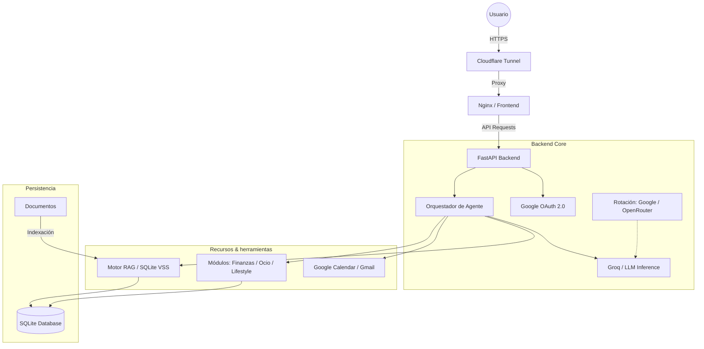

# Marco AI - Documentación Técnica Detallada

## 1. Introducción
**Marco AI** es un Agente Personal Inteligente full-stack diseñado para ejecutarse de forma eficiente en hardware limitado, específicamente una **Raspberry Pi 3**. Actúa como un asistente multiusuario privado, integrando servicios de Google, gestión de finanzas, estilos de vida y ocio, todo orquestado por modelos de lenguaje de gran tamaño (LLM).

## 2. Arquitectura del Sistema
El proyecto sigue una arquitectura de micro-servicios ligera contenida en Docker. A continuación se detalla el flujo de conexión:

## 3. Proceso de Ejecución de Casos de Uso
Cuando el usuario interactúa con Marco AI, se sigue un ciclo de razonamiento y acción basado en el patrón **ReAct (Reason + Act)**:

1. **Captura del Mensaje**: El usuario envía texto o voz desde el frontend. Si es voz, se transcribe mediante **Groq Whisper**.
2. **Identificación de Intención**: El mensaje llega al `Orquestador`. Este configura el prompt de sistema con la identidad de Marco y el contexto de la conversación.
3. **Loop de Razonamiento (Thinking)**:
    - Se envía el mensaje al LLM (Groq).
    - El LLM analiza si necesita herramientas para responder (ej: "¿qué tengo mañana en el calendario?").
    - Si es necesario, el LLM responde con un bloque de **código JSON** conteniendo la acción (ej: `action: calendar_list`).
4. **Ejecución de Herramientas**:
    - El Orquestador intercepta el JSON y ejecuta la función local correspondiente (Query a DB, API de Google, etc.).
    - El resultado de la herramienta se inyecta de nuevo en el historial como un mensaje de sistema.
5. **Generación de Respuesta Final**:
    - El LLM procesa los resultados de las herramientas y redacta una respuesta coherente en español.
    - Se limpia cualquier residuo técnico (JSON) para que el usuario solo vea el mensaje final.
6. **Entrega y Voz**: La respuesta se muestra en la UI y, si está activado, se convierte a audio mediante **Edge-TTS** para que Marco "hable".

## 3. Frontend: Experiencia de Usuario (UX)
El frontend está diseñado para ser extremadamente ligero (<5MB de RAM) sin sacrificar la estética.
- **Tecnologías**: HTML5, Vanilla JS, CSS3 con variables.
- **Sistema de Diseño**: Glassmorphism (paneles translúcidos, desenfoque de fondo y gradientes vibrantes).
- **Iconografía**: Phosphor Icons.
- **Routing**: Sistema manual basado en `hashchange` que carga componentes dinámicamente desde `js/components/`.
- **Integración de Voz**:
    - **STT (Speech-to-Text)**: Grabación vía `MediaRecorder` enviada a Groq Whisper.
    - **TTS (Text-to-Speech)**: Integración con `edge-tts` para voces naturales en español.

## 4. Backend: El Corazón de Marco
El backend está organizado de forma modular para facilitar su expansión:
- **Módulos (`app/modules/`)**:
    - `admin`: Gestión de dinero, presupuestos e ingresos.
    - `tiempo`: Integración con Google Calendar y Gmail.
    - `conocimiento`: Interfaz para la memoria (RAG).
    - `lifestyle`: Seguimiento de hábitos, comidas y lista de compras.
    - `entretenimiento`: Radar de ocio y ofertas de juegos.
- **Servicios (`app/services/`)**: Adaptadores para APIs externas (Google API Client).
- **Autenticación**: Flujo de Google OAuth 2.0 con persistencia de sesiones en JWT y base de datos.

## 5. El Cerebro: Orquestador y Agentes
Marco AI no es solo un chat; es un agente capaz de ejecutar acciones.
- **Motor LLM (Groq)**: Utiliza Llama 3.3 70B para una inferencia ultra rápida.
- **Estrategia de Fallback**: Si Groq falla o alcanza cuotas, el sistema rota automáticamente:
    1. **Nivel 1**: Groq (Llama 3.3 70B).
    2. **Nivel 2**: Google AI Studio (Gemini 2.0 Flash).
    3. **Nivel 3**: OpenRouter (Modelos variados como Llama 3 8B Free).
- **Tool Calling**: El orquestador (`orchestrator.py`) detecta bloques de código JSON generados por el LLM para ejecutar funciones locales (leer correos, crear eventos, guardar gastos, etc.).

## 6. Sistema RAG (Memoria)
La memoria del agente se gestiona mediante búsqueda vectorial:
- **Vector DB**: SQLite con la extensión `sqlite-vss`.
- **Fallback de Similitud**: Si la extensión no está disponible (ej: desarrollo local), el sistema utiliza una implementación manual de **Similitud Coseno** usando NumPy.
- **Aislamiento**: Cada búsqueda e inserción está filtrada estrictamente por `user_id`, garantizando que la memoria de un usuario sea inaccesible para otros.

## 7. Despliegue e Infraestructura
Optimizado para el bajo consumo de una Raspberry Pi 3:
- **Docker Multi-stage**: Reduce el tamaño de las imágenes finales eliminando dependencias de compilación.
- **Persistencia**: Volúmenes de Docker para la base de datos SQLite.
- **Seguridad**: Límite estricto de 20 usuarios configurado en el backend para proteger los recursos de la RPi.

## 8. Seguridad y Privacidad
- **Auth**: Únicamente mediante Google OAuth.
- **Datos**: Todos los registros en la base de datos (notas, eventos, archivos, vectores) están vinculados a un `user_id` único obtenido tras el login.
- **Acceso**: El uso de túneles de Cloudflare asegura una conexión cifrada de extremo a extremo sin exponer la IP pública de la Raspberry Pi.

---
*Documentación generada automáticamente por Antigravity - 2026*
