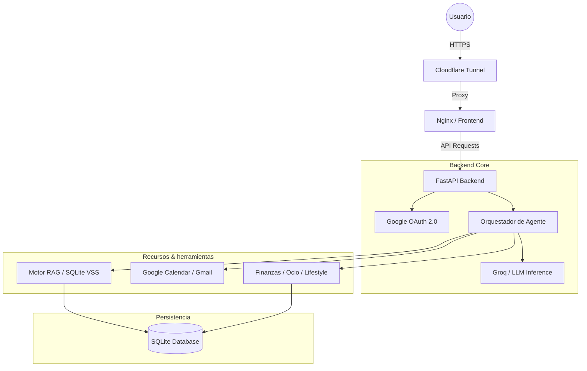

# 📘 Marco AI - Documentación Técnica Profunda

Esta documentación detalla la arquitectura, el diseño y la implementación de **Marco AI**, un Agente Personal Inteligente optimizado para eficiencia y privacidad.

---

## 🏗️ 1. Arquitectura del Sistema

Marco AI utiliza una arquitectura de microservicios contenida en Docker, diseñada específicamente para funcionar en hardware con recursos limitados (Raspberry Pi 3, 1GB RAM).

### 🌐 Red y Despliegue
- **Cloudflare Tunnel:** Proporciona acceso HTTPS seguro sin exponer la IP pública o abrir puertos en el router local.
- **Nginx (Frontend):** Actúa como servidor de archivos estáticos y proxy inverso para la API, consumiendo menos de 5MB de RAM.
- **Docker Multi-stage:** Las imágenes de backend se construyen en varias etapas para minimizar el tamaño final, instalando dependencias de compilación solo cuando es necesario.

---

## 🧠 2. El Orquestador de Agente (`orchestrator.py`)

El "cerebro" de Marco opera bajo un patrón **ReAct (Reason + Act)** con un bucle de ejecución asíncrono.

### 🔄 El Ciclo de Pensamiento
1. **Captura:** El mensaje del usuario se inyecta en un `messages` array con la identidad (System Prompt).
2. **Inferencia:** Se envía a Groq (Llama 3.3 70B) con una temperatura de `0.1` para asegurar precisión en la llamada a herramientas.
3. **Tool Calling:** El LLM genera bloques de código JSON (ej: `{"action": "calendar_list"}`).
4. **Intercepción y Ejecución:** El orquestador detecta el JSON mediante Regex, ejecuta la función local de Python (CRUD en DB o API externa) y añade el resultado como un mensaje de `system`.
5. **Humanización:** Si el LLM intenta responder con JSON o si la respuesta es puramente técnica, el orquestador detecta el patrón y realiza una llamada final forzando una respuesta humana y natural.

---

## 💾 3. Sistema RAG y Memoria (`rag/engine.py`)

La memoria persiste en SQLite, utilizando un enfoque híbrido para la búsqueda vectorial.

### 🛡️ Aislamiento y Metadatos
- **Seguridad Multi-usuario:** Cada consulta e inserción está filtrada estrictamente por `user_id`.
- **Filtrado por `tipo`:** El motor soporta filtrado por metadatos (tipo de dato: `habito`, `ingreso`, `suscripcion`, `gasto-mensual`, `comida`, `compra`). Esto reduce drásticamente el ruido en la recuperación semántica.
- **Búsqueda Vectorial:**
    - **Primario:** Extensión `sqlite-vss` para búsqueda nativa de alta velocidad.
    - **Fallback:** Similitud Coseno manual mediante NumPy (`vector / normalization`) para entornos de desarrollo sin extensiones compiladas.

---

## 🛠️ 4. Servicios e Integraciones

### 📅 Google Calendar & Gmail
- **Implementación:** Uso de `google-api-python-client` con OAuth2.
- **Acciones Dinámicas:** CRUD completo de eventos y gestión avanzada de correos (lectura, envío y etiquetado).
- **Consistencia de Datos:** Las respuestas de error de la API de Google son procesadas y devueltas al LLM para que pueda autocorregirse (ej: si falta una fecha).

### 💰 Gestión de Finanzas y Admin
- **Lógica Modular:** Separación de gastos mensuales (recurrentes), puntuales y suscripciones.
- **Motor de Balance:** Cálculo automático de presupuestos restando todos los gastos detectados (según metadatos en RAG) del total de ingresos registrados.

---

## 🎨 5. Frontend y UX Moderno

El frontend es una **Single Page Application (SPA)** minimalista construida sin frameworks pesados.

- **Routing:** Basado en `hashchange` para navegación instantánea sin recargas.
- **Glassmorphism:** Diseño premium con paneles translúcidos, desenfoque (`backdrop-filter`) y sombras suaves.
- **Interfaz de Voz:**
    - **STT:** Grabación nativa de navegador enviada a Groq Whisper para transcripción en milisegundos.
    - **TTS:** Integración con Edge-TTS para generar voces naturales en español localmente.

---

## 🧪 6. Calidad y Pruebas Unitarias

Marco AI cuenta con una infraestructura de pruebas robusta para garantizar la estabilidad.

- **Entorno Aislado:** `pytest` utiliza fixtures que crean una base de datos SQLite temporal (`marcoai_test.db`) para cada sesión de pruebas.
- **Cobertura Crítica:**
    - Pruebas de integración del motor RAG (Añadir/Marcar/Borrar hábitos).
    - Validación de aislamiento de datos entre usuarios.
    - Verificación de lógica financiera y cálculo de presupuestos.
- **Ejecución:** Automatizada mediante `run_tests.sh` que gestiona mocks de variables de entorno.

---

*Documentación técnica detallada - Antigravity 2026*
